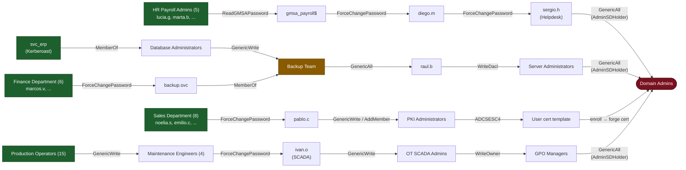
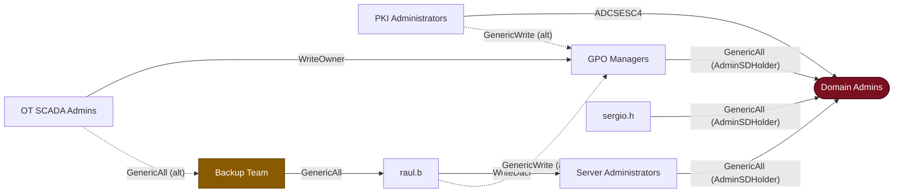

# REDIL — `redil.local`

A minimal, single-DC Active Directory lab modelling **Redil**, a mid-sized
Spanish cheese-making company (production, OT/SCADA, warehouse, sales, quality,
HR, finance…). It started as a family business and grew, so it accumulated
realistic misconfigurations.

The lab is designed for **GrexID**: it produces **long, convergent attack paths**
walkable by **many people** so the visual "alternative solutions / choke-point"
analysis has a rich, attractive graph to show.

## Design principles

- **One VM**: only the Domain Controller (like `GOAD-Mini`/`MINILAB`). All the
  identities (users, groups, OUs, ACLs, gMSA, ADCS template ACL) live on the DC,
  so ~210 identities cost a single machine.
- **Realistic company, not just attack paths.** ~205 active employees across all
  departments, plus service/shared/contractor accounts and disabled leavers.
  **Only ~27% of active users have any path to Domain Admin** — the rest are
  ordinary staff. Many role/resource/distribution groups (VPN, ERP, file shares,
  SharePoint, "All Staff", department sub-teams) and a few benign, scoped
  permissions (e.g. Service Desk L1 resets only warehouse users; "All Managers"
  owns the "All Staff" DL) exist **without** creating any escalation — the kind
  of well-intentioned-but-imperfect RBAC a real, still-maturing IT team builds.
- **English group names** (multi-market), **Spanish user logins**
  `name.<surname-initial>` (e.g. `lucia.g@redil.local`).
- **5 escalation paths, each ≥ 5 hops to Domain Admins, walkable by MANY people.**
  The escalation capability lives on **department/team groups**, not on single
  users: e.g. the whole 5-person `HR Payroll Admins` team walks Chain A, all 15
  `Production Operators` walk Chain D. ~43 low-privilege users have a ≥5-hop path.
- **Paths converge** on a few choke groups (great for GrexID's choke-point view),
  and **Chain E merges into Chain B at the `Backup Team` node**.
- **Some users have MANY paths** (legacy permission accumulation): a few IT
  admins sit in several privileged groups / carry stale ACEs, and cross-link
  ACEs interconnect the chains, so **~46 users reach DA ≥2 different ways**.
- **Multi-level OU tree** (`OU=REDIL > Users/Admin/Groups/... > dept > ...`, up to
  4 levels), not a flat single level.
- **No "everyone → Domain Admin" path.** The ADCS abuse is **ESC4 scoped to the
  `PKI Administrators` group only** — we deliberately do *not* publish GOAD's
  ESC1/ESC2/ESC9/ESC13 templates (those grant enrolment to `Domain Users`).

## Footholds (initial access) — several per path, so many people can start

| Account(s) | How it's obtained |
|---------|-------------------|
| `lucia.g`, `marta.b` | AS-REP roastable (HR Payroll Admins) |
| `noelia.s`, `emilio.c` | AS-REP roastable (Sales) |
| `marcos.v` | AS-REP roastable + `passwordnotreqd` (Finance, legacy) |
| `svc_erp` | Kerberoastable (SPN `HTTP/erp.redil.local`) |
| `svc_sql`, `svc_web` | Kerberoastable service accounts |
| Production operators | password hinted in `description` / weak reused creds |

Any compromised member of an entry team walks the whole path, so a single
mitigation rarely closes a path — exactly what GrexID's alternatives view shows.

## The 5 escalation paths

**Chain A — HR Payroll team (5 people) → gMSA → password resets (5 hops)**
```
<HR Payroll Admins, 5 members> ─ReadGMSAPassword→ gmsa_payroll$
        ─ForceChangePassword→ diego.m ─ForceChangePassword→ sergio.h
        ─GenericAll (via AdminSDHolder)→ Domain Admins
```

**Chain B — ERP kerberoast → nested groups → server admins (5 hops)**
```
svc_erp ─MemberOf→ Database Administrators ─GenericWrite→ Backup Team
        ─GenericAll→ raul.b ─WriteDacl→ Server Administrators
        ─GenericAll (via AdminSDHolder)→ Domain Admins
```

**Chain C — Sales team (8) → Purchasing → PKI → ADCS ESC4 (5 hops)**
```
<Sales Department, 8 members> ─ForceChangePassword→ pablo.c
         ─GenericWrite(AddMember)→ PKI Administrators
         ─ADCSESC4 (control of a published template)→ Domain Admin
```

**Chain D — Production (15) → Maintenance Engineers (4) → SCADA → GPO (6 hops)**
```
<Production Operators, 15 members> ─GenericWrite→ Maintenance Engineers (4)
        ─ForceChangePassword→ ivan.o ─GenericWrite→ OT SCADA Admins
        ─WriteOwner→ GPO Managers ─GenericAll (via AdminSDHolder)→ Domain Admins
```

**Chain E — Finance team (6) → backup.svc → MERGES INTO Chain B (6 hops)**
```
<Finance Department, 6 members> ─ForceChangePassword→ backup.svc
        ─MemberOf→ Backup Team  ◀── merge point with Chain B
        ─GenericAll→ raul.b ─WriteDacl→ Server Administrators
        ─GenericAll (via AdminSDHolder)→ Domain Admins
```

`Backup Team` is the shared junction: both the ERP path (B) and the Finance
path (E) funnel through it, so the graph shows a clear convergence.

Every edge above is one that SharpHound collects and GrexID renders:
`MemberOf, ReadGMSAPassword, ForceChangePassword, GenericWrite, AddMember,
GenericAll, WriteDacl, WriteOwner, ADCSESC4` (terminal DA control via AdminSDHolder).

## Attack-path graph



Green = initial-access teams (many people share each path) · amber = `Backup Team`,
the shared junction where Chains B and E converge · red = the `Domain Admins`
target.

## Users with multiple escalation paths (legacy accumulation)

Real environments have admins who, over the years, were dropped into several
privileged groups or handed one-off ACEs that were never cleaned up — so they
reach Domain Admin **several different ways**. GrexID flags these. In REDIL:

- **`raquel.dsi`** — member of `Database Administrators` + `Backup Team` +
  `GPO Managers` (≈7 distinct paths to DA).
- **`nacho.dsi`** — member of `Server Administrators` + `PKI Administrators`
  (Chain B terminal *and* the ESC4 route).
- **`sonia.legacy`** — no privileged group membership, but three stale direct
  ACEs: `GenericAll` on `Backup Team`, `GenericWrite` on `PKI Administrators`,
  `ForceChangePassword` on `sergio.h` (≈6 paths — pure ACL sprawl).

On top of that, **cross-link ACEs** interconnect the chains so ordinary pivots
also gain alternative routes (dashed edges below): `raul.b → GPO Managers`,
`OT SCADA Admins → Backup Team`, `PKI Administrators → GPO Managers`. In total
**~46 users have ≥2 distinct paths** to Domain Admins.



## Organisational structure & benign roles

A **multi-level OU tree** (not flat), the way a real company grows its AD:

```
OU=REDIL
├── OU=Users
│   ├── OU=Production   OU=Sales     OU=Finance   OU=HR
│   ├── OU=Quality      OU=Marketing OU=Purchasing
│   └── OU=Maintenance  OU=Warehouse OU=Management
├── OU=Admin
│   ├── OU=Tier0
│   ├── OU=IT
│   │   └── OU=Administration   ← 4th level: legacy IT-admin accounts
│   └── OU=Servers
├── OU=Groups
│   ├── OU=Security       ← security groups
│   └── OU=Distribution   ← All Staff / All Managers / Department Heads
├── OU=ServiceAccounts
├── OU=SharedAccounts
├── OU=Contractors
└── OU=Disabled          ← leavers (disabled accounts)
```

Benign, **non-escalating** groups and permissions (present for realism, none of
them reach Domain Admin):

Benign, **non-escalating** groups and permissions (present for realism, none of
them reach Domain Admin):

- **Role sub-teams**: Production Line Workers, Shift Leaders, Logistics &
  Transport, Quality Auditors, Customer Service, Accounts Payable/Receivable,
  Maintenance Technicians, Service Desk L1, R&D New Products, Reception…
- **Resource/access groups**: VPN Users, WiFi Corporate, ERP Users, CAD Software
  Users, Fileshare RW/RO groups, SharePoint Contributors/Readers, Office Printer
  Admins.
- **Distribution/org**: All Staff, All Managers, Department Heads.
- **Scoped operational permissions** (lateral, never to DA): `Service Desk L1`
  can reset passwords of `OU=Warehouse` users only; `All Managers` has
  `GenericAll` over the `All Staff` distribution list; `Department Heads`/`HR`
  have read-only visibility over certain OUs.

## Password / dictionary test set

~14% of accounts carry deliberately weak passwords — some typical dictionary
entries (`Password123`, `Verano2024`…) and some derived from the local context
(Palencia, Villalón de Campos, Tierra de Campos and nearby monuments:
`Villalon2024`, `RolloDeVillalon`, `PataDeMula`, `CristoDelOtero`,
`CanalDeCastilla`, `LaOlmeda2024`…). This is meant to exercise **GrexID's
dictionary generation and password audit**. See `PASSWORD_TESTSET.md` for the
seed terms and the ground-truth crackable accounts. Several sit on
AS-REP/kerberoastable footholds, so cracking them leads straight into a chain.

## Custom scripts (run on the DC, after AD data + ACLs)

- `scripts/attributes.ps1` — sets AS-REP roasting (`DoesNotRequirePreAuth`) and
  `passwordnotreqd` flags.
- `scripts/gmsa_readers.ps1` — grants `HR Payroll Admins` read access to the
  `gmsa_payroll` managed password → `ReadGMSAPassword` edge.

Two ESC/edge behaviours are proper GOAD vuln roles, configured from `config.json`
(`vulns` + `vulns_vars`) and run as the domain admin (`become: runas`):

- `vulns/adcs_esc4` (modelled on `vulns/adcs_esc7`) grants `PKI Administrators`
  `GenericAll` over the published `User` template → scoped `ADCSESC4` edge. It
  must run elevated: modifying a default template's DACL needs Enterprise Admin
  rights (a plain script running as `vagrant` fails with "Access is denied").
- `vulns/adminsdholder` grants the terminal principals of Chains A, B/E and D
  (`sergio.h`, `Server Administrators`, `GPO Managers`) `GenericAll` over the
  **AdminSDHolder** object and then **forces SDProp**. This is how GOAD makes a
  durable `GenericAll → Domain Admins` edge (cf. `lord.varys`): a direct ACE on
  the protected `Domain Admins` group is reverted by SDProp every ~60 min, but an
  ACE on AdminSDHolder is *copied onto* every protected group by SDProp, so it
  persists and materialises as a real `GenericAll → Domain Admins` edge. The
  direct `GenericAll → Domain Admins` ACEs are also set in `config.json` (for the
  immediate edge, GOAD-style); forcing SDProp makes the propagated copy appear at
  once instead of waiting up to an hour.

## Deploy

```bash
# from the GOAD root
./goad.sh -t install -l REDIL -p virtualbox        # or -p vmware
```

The DC installs an Enterprise Root CA (needed for the ESC4 chain) but **web
enrolment / ESC8 is disabled** to keep the ADCS surface to the single scoped ESC4.

## Feed GrexID

Once deployed, run a SharpHound collection against `redil.local` and upload the
resulting ZIP to GrexID (SharpHound / BloodHound v6 ingestion). GrexID will then
surface the four chains, their shared intermediate nodes, and the alternative
mitigations.
